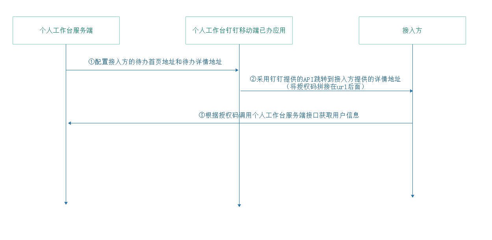
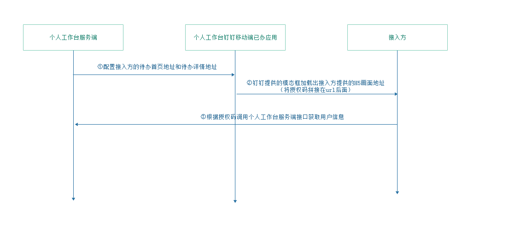
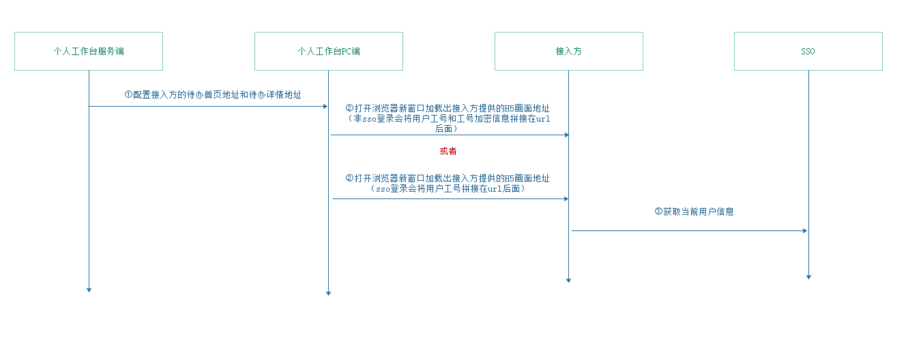

# 个人工作台已办接入流程

## 钉钉移动端已办接入流程

### 概述：
钉钉端已办接入采用打开接入方H5地址查看详情

### 接入流程：

1. 个人工作台服务端配置接入方提供的待办首页地址（用户点击系统入口时直接跳转）和已办详情地址（已办列表）。

2. 个人工作台采用钉钉提供的API，打开接入方提供的详情地址。会将当前待办的业务参数（例如：待办id、单据号、流程编码等...）和当前用户的授权码（authCode）拼接在地址后面。

3. 接入方根据授权请求个人工作台提供的接口获取当前登录人的用户基本信息。

## 钉钉PC端已办接入流程

### 概述：
钉钉PC端采用模态框的方式打开接入方提供的H5画面地址。

### 接入流程：

1. 个人工作台服务端配置接入方提供的待办首页地址（用户点击系统入口时直接跳转）和已办详情地址（已办列表）。

2. 个人工作台钉钉PC通过模态框打开接入方提供的H5画面地址。①系统入口接入：打开时会在地址后面拼接当前用户的授权码，当前用户使用语言。②已办列表接入：打开已办详情时会将当前待办的业务参数（例如：待办id、单据号、流程编码等...）和当前用户授权码拼接在地址后面。

3. 接入方根据授权请求个人工作台获取当前登录人的用户信息。

## 个人工作台PC端已办接入流程

### 概述：
个人工作台PC端采用打开新窗口的方式，接入方可通过以上两种方式获取用户信息。1.广丰标准SSO；2.个人工作台将当前登录用户工号拼接到URL地址后面（userId），由接入方自行获取用户其他信息。

### 接入流程：

1. 个人工作台服务端配置接入方提供的待办首页地址（用户点击系统入口时直接跳转）和已办详情地址（已办列表）。

2. 个人工作台PC端跳转接入方提供的H5画面地址。跳转到接入方的首页时判断当前用户是否为SSO登录，如果为非SSO登录，个人工作台将当前用户工号和工号的加密值传递给接入方。

3. 如果是SSO登录，接入方从SSO获取当前登录人的用户信息。如果非SSO登录，个人工作台将当前登录人工号和工号加密字符串，以及当前时间戳拼接在地址后面，接入方根据个人工作台提供的加密key，将工号加密后的值和传递的加密信息值进行比较，从而判断传递工号是否正确。