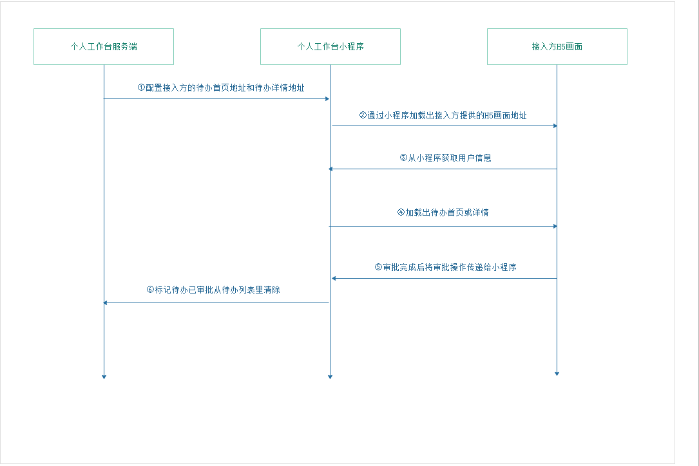
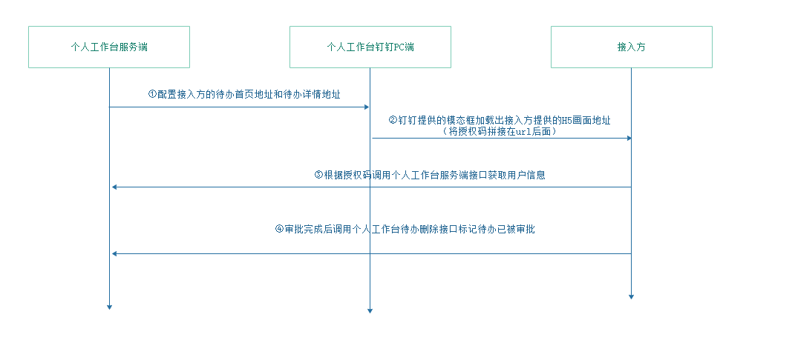
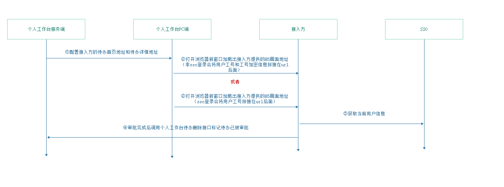

# 个人工作台待办接入流程

## 小程序待办接入
### 概述：
小程序端接入接入方H5时采用小程序 + webView方式，当用户在小程序里点击接入方的系统入口（我的待办首页）或待办（流程列表）时通过webview的方式打开接入方提供的地址。
### 接入流程：

1. 个人工作台服务端配置接入方提供的待办首页地址、待办详情地址

2. 个人工作台小程序跳转接入方提供的H5画面地址。跳转到接入方的首页时会在地址后面拼接当前系统类型、系统中文名称、系统日文名称，跳转到待办详情时会将当前待办的业务参数（例如：待办id、单据号、流程编码等...）拼接在地址后面。

3. 接入方通过小程序提供的通信JS从小程序里获取到当前登录人的用户信息。

4. 根据获取到的待办参数和用户信息加载出待办详情。

5. 当审批完成后将审批操作的结果传递给小程序，小程序将待办从列表里面清除。（备注：此处只进行逻辑清除，实际待办更新、删除由Kafka进行处理）

6. 小程序请求个人工作台服务端接口标记当前待办已审批。

## 钉钉PC端接入流程

### 概述：
钉钉PC端采用模态框的方式打开接入方提供的H5画面地址。

### 接入流程：

1. 个人工作台服务端配置接入方提供的待办首页地址和待办详情地址

2. 个人工作台钉钉PC通过模态框打开接入方提供的H5画面地址。打开接入方的首页时会在地址后面拼接当前用户的授权码，当前用户使用语言，打开待办详情时会将当前待办的业务参数（例如：待办id、单据号、流程编码）和当前用户的授权码拼接在地址后面。

3. 接入方根据授权请求个人工作台获取当前登录人的用户信息。

4. 审批完成后接入方调用个人工作台的待办删除接口标记当前待办已审批。（备注：此处只进行逻辑清除，实际待办更新、删除由Kafka进行处理）

## 个人工作台PC端接入流程

### 概述：
个人工作台PC端采用打开新窗口通过SSO或者安全验证跳转接入方系统，采用url传参，接入方系统根据url参数中userId获取登录人工号，由接入方在自己系统中获取用户信息。

### 接入流程：

1. 个人工作台服务端配置接入方提供的待办首页地址和待办详情地址。

2. 个人工作台PC端跳转接入方提供的H5画面地址。跳转到接入方的首页时判断当前用户是否为SSO登录，如果为非SSO登录，个人工作台将当前用户工号和工号的加密值传递给接入方。

3. 如果是SSO登录，接入方从SSO获取当前登录人的用户信息。如果非SSO登录，个人工作台将当前登录人工号和工号加密字符串，以及当前时间戳拼接在地址后面，接入方根据个人工作台提供的加密key，将工号加密后的值和传递的加密信息值进行比较，从而判断传递工号是否正确。

4. 审批完成后接入方调用个人工作台的待办删除接口标记当前待办已审批。（备注：此处只进行逻辑清除，实际待办更新、删除由Kafka进行处理）
